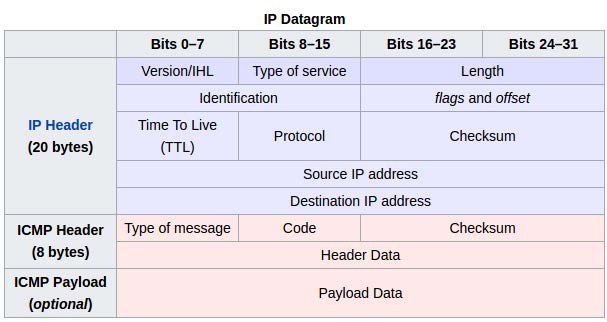
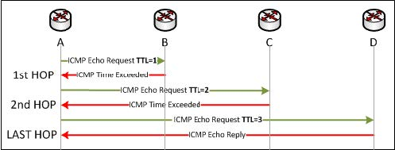
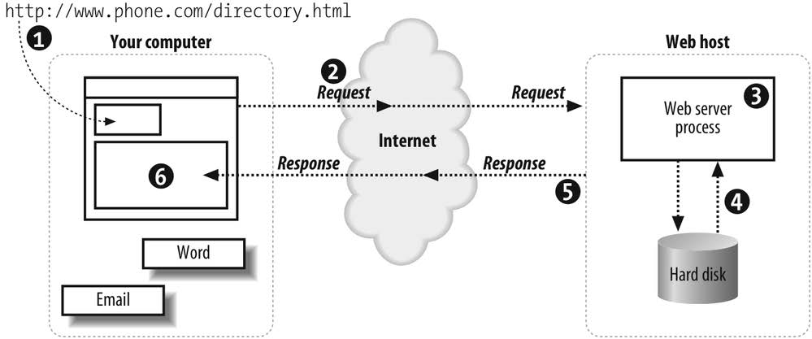
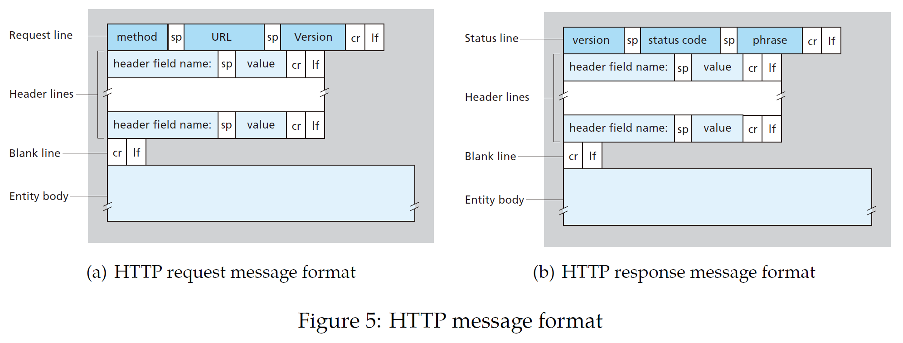
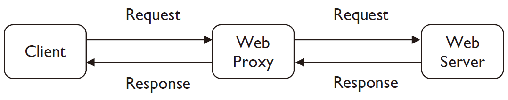
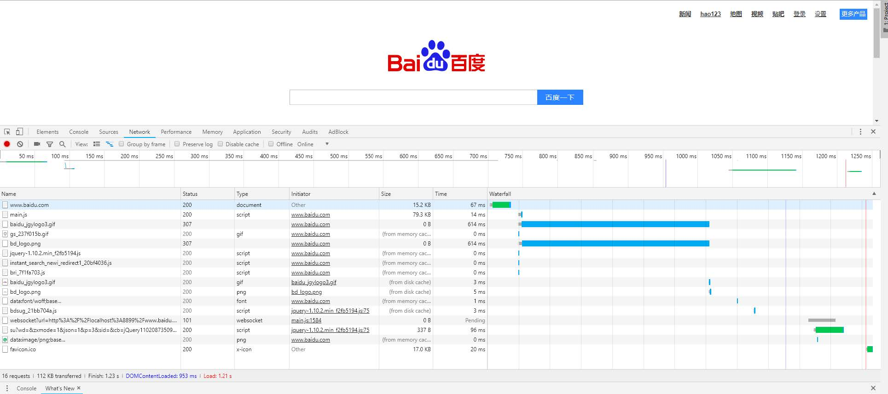

Table of Contents
=================
   * [Network Applications Development in Python](#network-applications-development-in-python)
   * [ICMP Ping](#icmp-ping)
      * [Purpose](#purpose)
      * [Principle](#principle)
      * [Function Implementations](#function-implementations)
      * [Result](#result)
   * [Traceroute](#traceroute)
      * [Purpose](#purpose-1)
      * [Principle](#principle-1)
      * [Function Implementations](#function-implementations-1)
      * [Result](#result-1)
   * [Web Server](#web-server)
      * [Purpose](#purpose-2)
      * [Principle](#principle-2)
      * [Function Implementations](#function-implementations-2)
      * [Result](#result-2)
         * [WebServer.py](#webserverpy)
         * [Client.py](#clientpy)
   * [Web Proxy](#web-proxy)
      * [Purpose](#purpose-3)
      * [Principle](#principle-3)
      * [Function Implementations](#function-implementations-3)
      * [Result](#result-3)
         * [Browser Test](#browser-test)
         * [WebProxy.py](#webproxypy)
         
# Network Applications Development in Python
[](https://github.com/Hephaest/ComputerNetworkApplications/blob/master/LICENSE)
[](https://www.python.org/downloads/release/python-367/)

English | [中文](README_CN.md)

Last updated on `2019/07/10`

This project is designed to increase your competency in developing socket-based applications.
# ICMP Ping
## Purpose
This task is to recreate the ping client discussed in **Lecture 3: Delay, Loss & Throughput**. 
Ping is a tool used to measure delay and loss in computer networks. 
In practice, we can analyse and determine the network failures by using `ping` command. Also, we can choose the best proxy server based on the ping results of different IP addresses.
## Principle
Ping traditionally uses **Internet Control Message Protocol** (**ICMP**) messages to measure delay and loss in computer networks: localhost sends echo request messages (with an ICMP type code of 8) in ICMP packets to another host. Once a message has reached that host, it is sent back to the sender. The localhost then unpacks the packet and extract the ICMP type code and match the ID between the request and reply. If the remote host responds with an echo reply message (with an ICMP type code of 0), then we can calculate the period of time elapsed between sending the request and receiving the reply, in turn, accurately determine the network delay between the two hosts.

**Attention**: The structure of IP datagram and ICMP error codes (with an ICMP type code of 3) are shown as follows. Internet checksum is also the important part of the packet but it’s not the core of my function implementations.
<p align="center"></p>
<p align="center"></p>

## Function Implementations
Based on the above principles, firstly, I need to create a socket associated with protocol ICMP and set the timeout to control the time socket used to receive a packet.
```Python
# run a privileged TCP socket, 1 is socket module constant associated with protocol ICMP.
icmp_socket = socket.socket(socket.AF_INET, socket.SOCK_RAW, 1)
icmp_socket.setsockopt(socket.SOL_SOCKET, socket.SO_RCVTIMEO, timeout)
```
After creating a socket, I need to implement a function to build, pack and send the ICMP packet to the destination host. As the code is shown, if I want to create a 32-byte size packet, I will only have four byte-length to store payload data. I decided to store the current time frame in float format (4 bytes). However, I will never use this data to calculate the total network delay because of precision loss. "!" means the packet should be resolved by network byte order.

Build and Pack ICMP Packet Source:
```Python
def receive_one_ping(icmp_socket, port_id, timeout, send_time):
    while True:
        # 1. Wait for the socket to receive a reply.
        wait_for_data = select.select([icmp_socket], [], [], timeout)
        # 2. Once received, record the time.
        data_received = time.time()
        rec_packet, addr = icmp_socket.recvfrom(1024)
        ip_header = rec_packet[8: 12]
        icmp_header = rec_packet[20: 28]
        payload_size = struct.calcsize("!f")
        # 3. Unpack the packet header for useful information.
        type, code, checksum, id, sequence = struct.unpack("!bbHHh", icmp_header)
        # 4. Check that the ID matches between the request and reply.
        if type == 0 and id == port_id:  # type should be 0.
            ttl = struct.unpack("!b", ip_header[0:1])[0]
            delay_time = data_received - send_time
        # 5. Return byte size, latency and TTL.
            return payload_size * 8, delay_time, ttl
        elif type == 3 and code == 0:
            return 0  # Network unreachable error.
        elif type == 3 and code == 1:
            return 1  # Host unreachable error.
```
When I get all ping test results from the same host, I need another function to show minimum, average and maximum delay across all measurements.
```Python
def ping_statistics(list):
    max_delay = list[0]
    mini_delay = list[0]
    sum = 0
    for item in list:
        if item >= max_delay:
            max_delay = item
        elif item <= mini_delay:
            mini_delay = item
        sum += item
    avg_delay = int(sum / (len(list)))
    return mini_delay, max_delay, avg_delay
```
The last thing I should do is to handle exceptions. I need to handle different ICMP error code and the timeout by the returned value. The code is shown below:
```Python
def ping(host, count_num="4", time_out="1"):
    # 1. Look up a hostname, resolving it to an IP address.
    ip_addr = socket.gethostbyname(host)
    successful_list = list()
    lost = 0
    error = 0
    bytes = 32
    count = int(count_num)
    timeout = int(time_out)
    timeout_start = 0
    head = False
    timedout_mark = False
    for i in range(count):  # i is value of sequence.
        # Print header.
        ......
        try:
            # 2. Call doOnePing function.
            ping_delay = do_one_ping(ip_addr, timeout, i)
            # 3. Print out the returned delay information.
            if ping_delay == 0 or ping_delay == 1:
                # To get my laptop's IP address.
                ip_addr = socket.gethostbyname(socket.gethostname())
                print("Reply from {ipAdrr}: ".format(ipAdrr = ip_addr), end = "")
                result = "Destination host unreachable." if ping_delay == 0 else \
                         "Destination net unreachable."
                print(result)
                error += 1
            else:
                bytes, delay_time, ttl = ping_delay[0], int(ping_delay[1] * 1000), \
                                         ping_delay[2]
                print("Reply from {ipAdrr}: ".format(ipAdrr = ip_addr), end = "")
                # If a packet can be received successfully,
                # the list could append this delay time.
                successful_list.append(delay_time)
                # if delay_time < 1m, then we will get 0 ms.
                ......
        except TimeoutError:  # timeout type.
            lost += 1
            print("Request timed out.")
            # If it's not always a timeout case,
            # we might need to calculate the maximum latency.
            if timedout_mark is False:
                timedout_mark = True
        time.sleep(1)  # Every second.
    #  4. Continue this process until stopped.
    ......
```
## Result
```
C:\Users\asus\Desktop\lab_solution\ICMP Ping>ICMPPing.py>ping www.baidu.com
Pinging www.baidu.com [111.13.100.92] with 32 of data:
Reply from 111.13.100.92: bytes = 32 time = 28ms TTL = 51.
Reply from 111.13.100.92: bytes = 32 time = 35ms TTL = 51.
Reply from 111.13.100.92: bytes = 32 time = 33ms TTL = 51.
Reply from 111.13.100.92: bytes = 32 time = 31ms TTL = 51.

Ping statistics for 111.13.100.92:
    Packet: Sent = 4, Received = 4, lost = 0 (0% loss).
Approximate round trip times in milli - seconds:
    Minimum = 28ms, Maximum = 35ms, Average = 31ms.

C:\Users\asus\Desktop\lab_solution\ICMP Ping>ICMPPing.py>ping google.com
Pinging google.com [172.217.161.174] with 32 of data:
Request timed out.
Request timed out.
Request timed out.
Request timed out.

Ping statistics for 172.217.161.174:
    Packet: Sent = 4, Received = 0, lost = 4 (100% loss).
C:\Users\asus\Desktop\lab_solution\ICMP Ping>ICMPPing.py>ping www.baidu.com -n 6
Pinging www.baidu.com [111.13.100.92] with 32 of data:
Reply from 111.13.100.92: bytes = 32 time = 29ms TTL = 51.
Reply from 111.13.100.92: bytes = 32 time = 46ms TTL = 51.
Reply from 111.13.100.92: bytes = 32 time = 33ms TTL = 51.
Reply from 111.13.100.92: bytes = 32 time = 44ms TTL = 51.
Reply from 111.13.100.92: bytes = 32 time = 36ms TTL = 51.
Reply from 111.13.100.92: bytes = 32 time = 35ms TTL = 51.

Ping statistics for 111.13.100.92:
    Packet: Sent = 6, Received = 6, lost = 0 (0% loss).
Approximate round trip times in milli - seconds:
    Minimum = 29ms, Maximum = 46ms, Average = 37ms.

C:\Users\asus\Desktop\lab_solution\ICMP Ping>ICMPPing.py>ping www.baidu.com -n 6 -w 2
Pinging www.baidu.com [111.13.100.92] with 32 of data:
Reply from 111.13.100.92: bytes = 32 time = 25ms TTL = 51.
Reply from 111.13.100.92: bytes = 32 time = 35ms TTL = 51.
Reply from 111.13.100.92: bytes = 32 time = 20ms TTL = 51.
Reply from 111.13.100.92: bytes = 32 time = 55ms TTL = 51.
Reply from 111.13.100.92: bytes = 32 time = 34ms TTL = 51.
Reply from 111.13.100.92: bytes = 32 time = 37ms TTL = 51.

Ping statistics for 111.13.100.92:
    Packet: Sent = 6, Received = 6, lost = 0 (0% loss).
Approximate round trip times in milli - seconds:
    Minimum = 20ms, Maximum = 55ms, Average = 34ms.
```
# Traceroute
## Purpose
This task is to recreate the traceroute tool in Lecture 3: Delay, Loss & Throughput. This is used
to measure latency between the host and each hop along the route to a destination. In practice,
traceroute can find the routers between the source and destination host and how long it takes to
reach each router.
## Principle
<p align="center"></p>

As Figure is shown, the source host uses an ICMP echo request message, but with an important modification:
the **Time To Live** (**TTL**) value is initially set to 1. This ensures that we get a response from
the first hop. The TTL counter is decremented once the message arrives router. When TTL reaches
0, the message is returned to the source host with an ICMP type of 11 ( TTL has been exceeded
and IP datagram hasn’t reached the destination and be discarded). This process will be repeated
with increasing the TTL each time until we receive an echo reply back. If echo reply with ICMP type
of 0, this means IP datagram has reached the destination. Then we can stop running the script of
traceroute. During the process, exceptions could happen and the error codes we need to handle
are the same as ICMP Ping.
## Function Implementations
Based on above principles, firstly, except create a socket associated with protocol ICMP and set
a timeout to control the time socket used to receive a packet, I need to set the TTL of the socket by
`socket.setsockopt(level, optname, value)` function.
```Python
client_socket = socket.socket(socket.AF_INET, socket.SOCK_RAW, 1) # ICMP.
client_socket.setsockopt(socket.SOL_SOCKET, socket.SO_RCVTIMEO , time_out)
client_socket.setsockopt(socket.IPPROTO_IP, socket.IP_TTL, struct.pack('I', ttl))
```
After creating the socket, I need to implement a function to build, pack and send the ICMP
packet to the destination host. However, this part is the same as **Build and Pack ICMP Packet
Source** in ICMP Ping.

The next step is to wait and receive a reply. The socket will keep waiting until it receives a
packet or reaches a timeout limit. We need to discover and report *Destination Host Unreachable*
and *Destination Network Unreachable* by ICMP echo messages. This part is very similar to **Receive
Packet Source** but traceroute also needs to find out the current router’s IP address. The code is
shown below:
```Python
def receive_one_trace(icmp_socket, send_time, timeout):
    try:
        # 1. Wait for the socket to receive a reply.
        ... Similar to Receive Packet Source ...
        # 2. Once received, record the time.
        rec_packet, retr_addr = icmp_socket.recvfrom(1024)
        # 3. Unpack the packet header for useful information.
        ... Similar to Receive Packet Source ...
        # 4. Check whether packet loss or not by its type and code.
        ... Similar to Receive Packet Source ...
    except TimeoutError :
        print_str = "*   "  # timeout.
    finally:
        ..... # Print the latency.
    # return IP address of the current node.
    # If request timeout, just return the string.
    try:
        retre_ip = retr_addr[0]
    except IndexError:
        retre_ip = "Request timeout"
    finally:
        return retre_ip
```
The last thing I should do is to achieve repeated measurements for each node, resolve the IP
addresses found in the responses to their respective hostname and handle exceptions. The code is
shown below:
```Python
def trace_route(host, timeout=2):
    # Configurable timeout, set using an optional argument.
    # 1. Look up host name, resolve it to an IP address.
    ip_addr = socket.gethostbyname(host)
    ttl = 1
    print("Over a maximum of {max_hop} hops:\n".format(max_hop = MAX_HOP))
    print("Tracing route to " + host + " [{hostIP}]:".format(hostIP=ip_addr))
    for i in range(MAX_HOP):
        sys.stdout.write("{0: >3}".format(str(ttl) + "\t"))
        cur_addr = do_three_trace(ip_addr, ttl, i, timeout)
        try:
            sys.stdout.write("{0:<}".format(" " + socket.gethostbyaddr(cur_addr)[0] + " [" + cur_addr + "]" + "\n"))
        except (socket.herror, socket.gaierror):
            sys.stdout.write("{0:<}".format(" " + cur_addr + "\n"))
        if cur_addr == ip_addr :
            break
        ttl += 1
    sys.stdout.write("\nTrace complete.\n\n")
```
## Result
```
Over a maximum of 30 hops:
    Tracing route to www.baidu.com [111.13.100.91]:
    1 16 ms 15 ms 15 ms 10.129.0.1
    ...... # All successful
    5 * * * Request timeout
    6 * * * Request timeout
    ...... # All successful
    9 * * * Request timeout
    ...... # All successful
    13 * * * Request timeout
    14 22 ms 22 ms 21 ms 111.13.100.91
    Trace complete.

C:\Users\asus\Desktop\lab_solution\Traceroute>Traceroute.py>tracert 10.129.21.147
Over a maximum of 30 hops:
Tracing route to 10.129.21.147 [10.129.21.147]:
 1 Host unreachable * Host unreachable DESKTOP-6VPPJQ8 [10.129.34.15]
 2        * Host unreachable     *     DESKTOP-6VPPJQ8 [10.129.34.15]
 ...... All situations are the same
29 Host unreachable * Host unreachable DESKTOP-6VPPJQ8 [10.129.34.15]
30        * Host unreachable     *     DESKTOP-6VPPJQ8 [10.129.34.15]
Trace complete.
```
# Web Server
## Purpose
This task is to build a simple HTTP web server. As we learn from Lecture 4: Web & HTTP, Web
Servers are a fundamental part of the Internet, they serve the web pages and content that we are all
familiar with. A Web page consists of objects, these objects could be HTML files, JPEG images, Java
applet, etc. HTTP traffic is usually bound for port 80, with port 8080 a frequently used alternative.
Hence, the local port number 80 and 8080 is used by the virtual host (machine).
## Principle
HTTP/1.1 has many types of HTTP request, in this task, we only consider about HTTP GET request.
As Figure is shown, a simple web Server receives a HTTP request message for an object
through the Internet. Once it receives this request, the simple Web Server will extract the path of
the requested object from the message and then try to retrieve the requested object from the hard
disk. If it successfully finds the object in the hard disk, it sent the object back to the client with the
appropriate header (which will contain the Status-Code 200). Else, it will send the "Not Found"
web page to the client with HTTP response message (which will contain 404 Not Found" status
line)". HTTP request and response message format are shown in Figure 5.(a) and Figure 5.(b).
<p align="center"></p>
<p align="center"></p>

## Function Implementations
Based on the above principles, firstly, create a socket which could support IPv4 and bind to a
high numbered port above 1024. The Web Server is expected to listen to 5 requests at the same
time and has a capacity of handling multiple concurrent connections. 

Web Server Run Source:
```Python
def start_server(server_port , server_address):
    # Binding the Web Server to a configurable port, defined as an optional argument.
    # 1# 1. Create server socket
    server_socket = socket(AF_INET, SOCK_STREAM) #IPv4.
    # 2# 2. Bind the server socket to server address and server port.
    server_socket.bind(("", server_port))
    # 3# 3. Continuously listen for connections to server socket.
    server_socket.listen(5)
    while True:
        # 4. When a connection is accepted, call handleRequest function, passing new connection socket.
        connection_socket , (client_ip, client_port) = server_socket.accept()
        # Create a multithreaded server implementation, capable of handling multiple concurrent connections.
        start_new_thread(handle_request , (connection_socket , client_ip, client_port))
     # 5. Close server socket
     server_socket.close() # The server is always waiting and never close.

 # Start here
 server_port = int(sys.argv[1])
 server_address = gethostbyname(gethostname())
 start_server(server_port)
```
After creating the socket, Web Server needs to handle the HTTP GET request. Before handling,
I create a StrProcess class to rewrite the split method in the string module. I split a string by blank
space and only handle request line. Hence, when it finds character "\r", it will stop processing
and return the result. 

StrProcess Class Source:
```Python
class StrProcess(str):
    def __init__(self, str):
        """Inits StrProc with str"""
        self.str = str
    def split_str(self):
        """Performs split operation"""
        spilt_list = []
        start = 0
        for i in range(len(self.str)):
            if self.str[i] == " ":
                spilt_list.append(self.str[start:i])
                start = i + 1
            if self.str[i] == "\r":
                break
        return spilt_list[1]
```
The last thing is to handle the HTTP GET request and exceptions. I don’t need to write while true
loop to receive the HTTP request message because of non-persistent HTTP. If the socket receives
an empty message it should be closed. Otherwise, Web Server needs to check out whether the object
exists in cache or not. If the object exists then send the object to the client with "HTTP/1.1 200
OK\r\n\r\n", else "FileNotFoundError" exception happens then send the "Not Found" HTML
file to the client with "HTTP/1.1 404 Not Found\r\n\r\n". After sending an HTTP response message,
the HTTP server closes the TCP connection. The code is shown below:
```Python
def handle_request(tcp_socket, client_ip, client_port):
    print("Client ({ip}: {port}) is coming...".format(ip = client_ip, port = client_port))
    try:
        # 1. Receive request message from the client on the connection socket.
        msg = tcp_socket.recv(1024).decode()
        if not msg:
            print("Error! server receive empty HTTP request.")
            tcp_socket.close()
        # Create a new object (handlestr) from strProc class.
        handle_str = StrProcess(msg)
        # 2. Extract the path of the requested object from the message (the second part of the HTTP header).
        file_name = handle_str.split_str()[1:]
        # 3. Find the corresponding file from disk.
        # Check whether the requested object exists or not.
        f = open(file_name)
        f.close()
        # If object exists, ready to send "HTTP/1.1 200 OK\r\n\r\n" to the socket.
        status = "200 OK"
    except FileNotFoundError:
        # Else, ready to send "HTTP/1.1 404 Not Found\r\n\r\n" to the socket.
        status = "404 Not Found"
        file_name = "NotFound.html"
    re_header = "HTTP/1.1 " + status + "\r\n\r\n" #the last''\r\n'' means the end of header lines.
    # 4. Send the correct HTTP response
    tcp_socket.send(re_header.encode())
    # 5. Store in a temporary buffer
    with open(file_name, 'rb') as f:
        file_content = f.readlines()
    # 6. Send the content of the file to the socket
    for strline in file_content:
        tcp_socket.send(strline)
    # 7. Close the connection socket
    print("Bye to Client ({ip}: {port})".format(ip = client_ip, port = client_port))
    tcp_socket.close()
```
I write a separately HTTP client to query the Web Server. This client can send HTTP GET request
and receive the HTTP response message on the console. The advantage of this program is that it
can query the object by only entering an object’s name or choose to stay or leave.

HTTP client Source:
```Python
from socket import *
import sys

# 1. Set the web server's address
host_port = int(sys.argv[1])
host_address = gethostbyname(gethostname())
# 2. Create client socket to initiate TCP connection to the web server.
tcp_client = socket(AF_INET, SOCK_STREAM)
tcp_client.connect((host_address , host_port))
# 3. Enter the file client want to query the web server.
print("Hello, which document do you want to query?")
while True:
    obj = input("I want to query: ")
    # 4. Send the HTTP request message
    message = "GET /" + obj + " HTTP/1.1\r\n" \
              "Host: " + host_address + ":" + str(host_port) + "\r\n" \
              "Connection: close\r\n" \
              "Upgrade-Insecure-Requests: 1\r\n" \
              "User-Agent: Mozilla/5.0 (Windows NT 10.0; Win64; x64) AppleWebKit/537.36(KHTML, like Gecko) Chrome/70.0.3538.77 Safari/537.36\r\n" \
              ...... # Header lines
              "Accept-Language: zh-CN,zh;q=0.9,en-US;q=0.8,en;q=0.7\r\n\r\n"
    tcp_client.send(message.encode())
    while True:
        # 5. Receive HTTP response message and print it to the console.
        data = tcp_client.recv(1024)
        if not data:
            break
        print("Web server responded to your request:")
        print(data.decode())
    tcp_client.close() # close current connection.
    # 6. ask the client whether it wants to continue.
    ans = input('\nDo you want to cut this connection(y/n) :')
    if ans == 'y' or ans == 'Y':
        break
    elif ans == 'n' or ans == 'N':
        # Try again.
        print("Anything else I can help you?")
        tcp_client = socket(AF_INET, SOCK_STREAM)
        tcp_client.connect((host_address , host_port))
    else:
        print("Command Error, quit.")
        break
```
## Result
### WebServer.py
```
you can test the web server by accessing: http://10.129.34.15:8899/hello.html
Wait for TCP clients...
Client (10.129.34.15: 6123) is coming...
Bye to Client (10.129.34.15: 6123)
Client (10.129.34.15: 6135) is coming...
Bye to Client (10.129.34.15: 6135)

C:\User\asus\Desktop\lab_solution\Web Server>python Client.py 8899
Hello, which document do you want to query?
I want to query: hello.html
```
### Client.py
```
Web server responded to your request:
HTTP/1.1 200 OK
Web server responded to your request:
<!DOCTYPE html>
<html>
<head>
<title>Hello World HTML</title>
</head>
<body>
<h1>Hello World</h1>
</body>
Web server responded to your request:
</html>

Do you want to cut this connection(y/n) :n
Anything else I can help you?
I want to query: index.html
Web server responded to your request:
HTTP/1.1 404 Not Found
Do you want to cut this connection(y/n) :y
Process finished with exit code 0
```
# Web Proxy
## Purpose
This task is to build a simple Web Proxy. As we learn from Lecture 4: Web & HTTP, Web Proxy acts
as both client and server, which means it has all features of both Web Server and client. The most
significant difference between Web Proxy and Web Server is that both the request message sent
by the client and the response message delivered by the Web Server, pass through the Web Proxy.
Web Proxy is used in everywhere (university, company and residential ISP) to reduce response
time for clients request and traffic.
## Principle
The principle of Web Proxy is based on Web Server. Web Proxy receives the HTTP request message
from a client and extracts the method type from the request line.
- If the method type is **GET**, get the URL from the same line and check whether the requested
object exists in cache or not. Otherwise, the Web Proxy will forward the client’s request to
the web server. The web server will then generate a response message and deliver it to the
proxy server, which in turn sends it to the client and caches a copy for future requests.
- If the method type is **DELETE**, the Web Proxy also need to check out first. If the object
exists, just delete it from the cache and send the HTTP response message with Status-Code
200. Otherwise, the Web Proxy sends the HTTP response message with Status-Code 404.
- If method is **POST**, the handling process is easier than above method types, the Web Proxy
just write the object to disk in binary format and then send the HTTP response message with
Status-Code 200 (input is upload in entity body). If the method is PUT, only need to return true
in the entity body.
- If the method type is **HEAD**, the Web Proxy only send the status line and header lines of
HTTP response message back.

The simplified process is shown as follows.
<p align="center"></p>

## Function Implementations
Based on the above principles, firstly, create a socket which could support IPv4 and bind to a
high numbered port above 1024. The Web Proxy is similar to the Web Server except for single threaded.

I add some methods on StrProcess class to help Web Proxy get the object or connect to Web
Server more efficiently.

StrProcess Class Source:
```Python
class StrProcess(str):

    def __init__(self, str):
        """Inits StrProcess with str."""
        self.str = str

    def split_str(self):
        """Perform split_str operation."""
        spilt_list = []
        start = 0
        for i in range(len(self.str)):
            if self.str[i] == " ":
                spilt_list.append(self.str[start:i])
                start = i + 1
            if self.str[i] == "\r":
                break
        try:
            return spilt_list[0],spilt_list[1]
        except IndexError:
            return None

    def get_cmd_type(self):
        """Extract method type from HTTP request line."""
        return self.split_str()[0]

    def get_body(self):
        """Extract the entity body from HTTP request message body."""
        body_start = self.str.find('\r\n\r\n') + 4
        return self.str[body_start:]

    def get_referer(self):
        """Extract referer from HTTP request header lines."""
        ref_pos = self.str.find('Referer: ') + 9
        ref_stop = self.str.find('\r\n', ref_pos+1)
        get_ref = self.str[ref_pos:ref_stop]
        get_ref_start = get_ref.find('9/') + 2
        get_ref_path = self.str[ref_pos+get_ref_start:ref_stop]
        return get_ref_path

    def get_path(self):
        """Extract URL from HTTP request request line."""
        original_path = self.split_str()[1]
        for i in range(len(original_path)):
            if original_path[i] == "/":
                original_path = original_path[i+1:]
                return original_path

    def change_name(self):
        """Convert all special symbols to "-"."""
        original_name = self.get_path()
        for i in range(len(original_name)):
            if original_name[i] == "/" or original_name[i] == "?" \
                    or original_name[i] == "=" or original_name[i] == "&" \
                    or original_name[i] == "%":
                original_name = original_name[:i] + "-" + original_name[i+1:]
        return original_name

    def get_hostname(self):
        """Extract host name from URL."""
        whole_URL = self.get_path()
        for i in range(len(whole_URL)):
            if whole_URL[i] == "/":
                    host_name = whole_URL[:i]
                    return host_name
        return whole_URL
```
After creating the socket, Web Proxy needs to handle different HTTP request types and exceptions.
In this part, file handling should be used in binary format, we must consider the object type
(could be .jpg, .svg, .ico, etc).

Handle HTTP Request Source:
```Python
def start_listen(tcp_socket, client_ip, client_port):

    # 1. Receive request message from the client on connection socket.
    message = tcp_socket.recv(1024).decode()
    # Create a new object (handle_str) from StrProcess class.
    handle_str = StrProcess(message)
    print("client is coming: {addr}:{port}".format(addr = client_ip, port = client_port))
    file_error = False
    global host
    try:
        command = handle_str.get_cmd_type()
        # 2. Extract the path of the requested object from the message (second part of the HTTP header).
        filename = handle_str.change_name()
        # 3. Find the specific method type and handle the request.
        if command == "DELETE" :
            # Delete the object if it exists in the cache.
            os.remove("./Cache/" + filename)
            tcp_socket.send(b"HTTP/1.1 200 OK\r\n\r\n")
            print("File is removed.")
        elif command == "GET" or command == "HEAD":
            print("Client want to {c} the {o}.".format(c=command, o=filename))
            # Check whether the requested object exists or not.
            f = open("./Cache/" + filename, "rb")
            file_content = f.readlines()
            f.close()
            if command == "GET":
                print("File in cache!")
                # Find the corresponding file from disk if it exists.
                for i in range(0, len(file_content)):
                    tcp_socket.send(file_content[i])  # Send HTTP response message.
            else:  # "HEAD" method
                list_to_str = ""
                for i in range(0, len(file_content)):
                    list_to_str += file_content[i].decode()
                HTTP_header_end = list_to_str.find("\r\n\r\n")
                # Only send HTTP response message header lines
                tcp_socket.send(list_to_str[:HTTP_header_end+4].encode())
        elif command == "PUT" or command == "POST":  # Only implement upload files.
            f = open("./Cache/" + filename, "ab")
            f.write(b"HTTP/1.1 200 OK\r\n\r\n" + handle_str.get_body().encode())
            f.close()
            print("Update successfully!")
            tcp_socket.send(b"HTTP/1.1 200 OK\r\n\r\n")
            body_re = b"true" if command == "PUT" else handle_str.get_body().encode()
            tcp_socket.send(body_re)
        else:
            tcp_socket.send(b"HTTP/1.1 400 Bad Request\r\n\r\n")
    # 4. If the file doesn't exist in the cache, handle exceptions.
    except (IOError, FileNotFoundError):
        if command == "GET":
            # Create a socket on the proxy server
            c = socket(AF_INET, SOCK_STREAM)
            hostname = handle_str.get_hostname()
            file = handle_str.split_str()[1]
            print("The file isn't in the cache!")
            try:
                # Connect to the socket at port 80.
                c.connect((hostname, 80))
                host = hostname  # record the real hostname.
                request = "GET " + "http:/" + file + " HTTP/1.1\r\n\r\n"
            except:
                try:
                    # Need to use the global host or referer hostname.
                    new_host = handle_str.get_referer() if host == "" else host
                    c.connect((new_host, 80))
                    request = "GET " + "http://" + new_host + file + " HTTP/1.1\r\n\r\n"
                except:
                    tcp_socket.send(b"HTTP/1.1 404 Not Found\r\n\r\n")
                    with open("./Cache/NotFound.html", 'rb') as f:
                        file_content = f.readlines()
                    for strline in file_content:
                        tcp_socket.send(strline)
                    file_error = True
            if file_error is False:
                c.sendall(request.encode())
                # Read the response into the buffer.
                print("The proxy server have found the host.")
                # Create a new file in the cache for the requested file.
                # Also send the response in the buffer to client socket
                # and the corresponding file in the cache.
                writeFile = open("./Cache/" + filename, "wb")
                print("The proxy server is receiving data...")
                # Receive HTTP response message until all messages are received.
                while True:
                    data = c.recv(4096)
                    if not data:
                        break
                    sys.stdout.write(">")
                    # Send the content of the file to the socket.
                    tcp_socket.sendall(data)
                    writeFile.write(data)
                writeFile.close()
                sys.stdout.write("100%\n")
            c.close()
        elif command == "DELETE":
            tcp_socket.send(b"HTTP/1.1 204 Not Content\r\n\r\n")
    except (ConnectionResetError, TypeError):
        print("Bye to client: {addr}:{port}".format(addr = client_ip, port = client_port))
    # Close the client socket
    print("tcp socket closed\n")
    tcp_socket.close()
```
## Result
### Browser Test
<p align="center"></p>

### WebProxy.py
```
C:\Users\asus\Desktop\lab_solution\Web Proxy>python WebProxy.py 8899
Wait for TCP clients...
wait for request:
client is coming: 127.0.0.1:4596
Client want to GET the s-wd-facebook-rsv_bp-0-ch-tn-baidu-bar-rsv_spt-3-ie-utf-8-rsv_enter-1-oq-face-f-3-inputT-3356.
The file is not in the cache!
The proxy server have found the host.
The proxy server is receiving data...
>>>>>>>>>>>>>>>>>>>>>>>>>>>>>>>>>>>>>>>>>>>>>>>>>>>>>>>>>>>>>>>>>>>>100%
tcp socket closed
```
